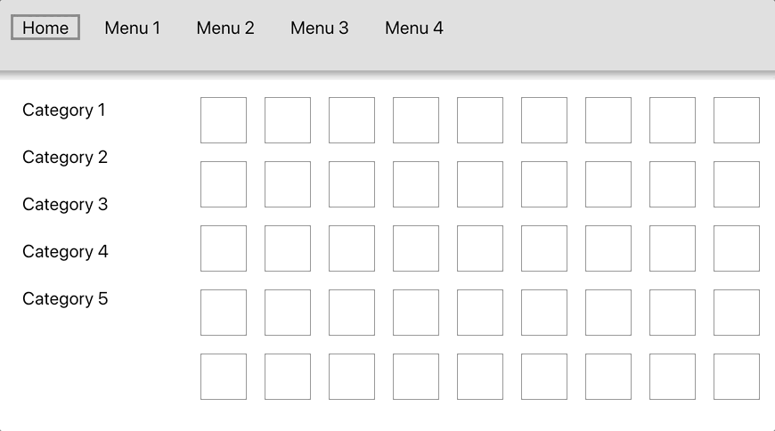

# Overview
Directional navigation library for JavaScript applications to support 10 foot (TV) experience



# Disclaimer
This is a work in progress and there is no guarantee the library will work in your case. Please post your requests and bugs in the [Issues](https://github.com/ashevtcov/dirnav/issues) section of the GitHub repository.

# Installation
To install via NPM execute the following command
```shell
npm i dirnav
```

# Usage Example

## Initialization

Initialize navigation on application load using code below.

```javascript
import { initDirNav } from 'dirnav';

initDirNav({
  focusableClass: 'focusable',
  selectedClass: 'selected',
  preventDefaultEvents: true
});
```

> All options are optional as well as the argument

> The examples are written in React, therefore `className` attribute is used instead of `class`

## Focusable Elements

You can mark elements, that are supposed to receive focus, with `focusable` class. The `selected` class will be used to indicate current selection (do not set it in your DOM). If `preventDefaultEvents` is set to `true`, `e.preventDefault()` will be called on navigation events (for example, if LEFT ARROW or ENTER buttons is pressed).

```html
<div>
  <div className='focusable'>One</div>
  <div className='focusable'>Two</div>
  <div className='focusable'>Three</div>
</div>
```

## Default Selection

Mark any `focusable` element with `default-selection` class so the library can pre-select it.

```html
<div>
  <div className='focusable default-selection'>One</div>
  <div className='focusable'>Two</div>
  <div className='focusable'>Three</div>
</div>
```

After all DOM elements are created, call the following method to execute pre-selection.

```javascript
import { selectDefaultItem } from 'dirnav';

selectDefaultItem({
  selectedClass: 'selected',
  defaultSelectionClass: 'default-selection'
});
```

## Hardcoded Navigation

To specify next navigation element for any direction, refer to the example below:

```html
<div>
  <div className='focusable default-selection' next-down='.three'>One</div>
  <div className='focusable'>Two</div>
  <div className='focusable three'>Three</div>
</div>
```

In this case, if user presses `DOWN`, to navigate from the first element, the system
will automatically select element with class `three`, as specified in the _query_ of
the `next-down` attribute value. Hardcoded navigation is available for all directions
using the according attribute names: `next-left`, `next-right`, `next-down` and `next-up`.

> The `document.querySelector` function is used to select an element,
hardcoded this way

# Next steps
1. Auto-scrolling
2. Progressive navigation (wider area of search)
3. Navigation areas (groupping)
4. UI Tests via Cypress
